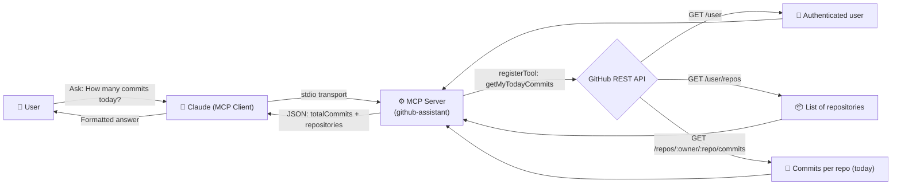

# GitHub Assistant MCP Server

A lightweight [Model Context Protocol (MCP)](https://modelcontextprotocol.io) server that connects Claude (or any MCP-compatible client) directly to your GitHub account — letting Claude answer questions like *"How many commits did I make today?"* by calling the GitHub REST API on your behalf.

---

##  Architecture / Flow



**In short:**
1. You ask Claude a question in natural language.
2. Claude recognizes it matches the `getMyTodayCommits` tool and invokes the MCP server over **stdio**.
3. The server authenticates with your `GITHUB_TOKEN`, fetches your GitHub username, lists your repositories, then queries commits made today across all of them.
4. The aggregated result (total commits + per-repo breakdown) is returned to Claude, which turns it into a natural-language answer for you.

---

## ✨ Features

-  Secure token-based GitHub authentication (via `.env`, never hardcoded)
-  Aggregates today's commit count across **all** your repositories
-  Built on the official `@modelcontextprotocol/sdk`
-  Works with any MCP-compatible client (Claude Desktop, Claude Code, etc.)
-  Zero database, zero server hosting — runs locally over stdio

---

## Project Structure

```
github-assistant-mcp/
├── src/
│   └── index.ts          # MCP server entry point (tool registration + logic)
├── .env                   # Your local GitHub token (not committed)
├── .env.example           # Template for required env vars
├── package.json
├── tsconfig.json
└── README.md
```

---

## Getting Started

### 1. Fork & Clone

```bash
# Fork this repo on GitHub first, then:
git clone https://github.com/<your-username>/github-assistant-mcp.git
cd github-assistant-mcp
```

### 2. Install dependencies

```bash
npm install
```

### 3. Create a GitHub Personal Access Token

1. Go to **GitHub → Settings → Developer settings → Personal access tokens → Fine-grained tokens**
2. Generate a new token with at least:
   - `Contents: Read-only`
   - `Metadata: Read-only`
3. Copy the generated token.

### 4. Configure environment variables

```bash
cp .env.example .env
```

```env
# .env
GITHUB_TOKEN=ghp_your_token_here
```

>  Never commit your `.env` file. Make sure it's listed in `.gitignore`.

### 5. Build the project

```bash
npm run build
```

This compiles `src/index.ts` into a runnable JS entry point (e.g. `dist/index.js`).

### 6. Run it standalone (optional sanity check)

```bash
node dist/index.js
```

You should see:

```
GitHub MCP SERVER STARTED
```

The server is now listening on stdio, waiting for an MCP client to connect.

---

## Connecting to Claude

### Claude Desktop

Edit your Claude Desktop config file:

- **macOS:** `~/Library/Application Support/Claude/claude_desktop_config.json`
- **Windows:** `%APPDATA%\Claude\claude_desktop_config.json`

Add an entry under `mcpServers`:

```json
{
  "mcpServers": {
    "github-assistant": {
      "command": "node",
      "args": ["/absolute/path/to/github-assistant-mcp/dist/index.js"],
      "env": {
        "GITHUB_TOKEN": "ghp_your_token_here"
      }
    }
  }
}
```

Restart Claude Desktop. You should see **github-assistant** listed under the 🔌 connectors/tools icon.

### Claude Code / CLI

```bash
claude mcp add github-assistant -- node /absolute/path/to/github-assistant-mcp/dist/index.js
```

---

## Available Tools

| Tool | Description | Parameters |
|---|---|---|
| `getMyTodayCommits` | Returns the total number of commits made today across all your repositories, plus a per-repository breakdown | None |

**Example response:**

```json
{
  "totalCommits": 7,
  "repositories": {
    "my-portfolio": 3,
    "mcp-experiments": 4
  }
}
```

---

## Forking & Extending

Want to add your own tools (e.g. `getOpenPullRequests`, `getStarredRepos`)? The pattern is simple:

```typescript
server.registerTool(
  "yourToolName",
  { description: "What this tool does" },
  async () => {
    // 1. Call GitHub (or any) API
    // 2. Shape the response
    return {
      content: [{ type: "text", text: JSON.stringify(result) }],
    };
  }
);
```

**Steps to contribute:**

1. Fork this repository
2. Create a feature branch: `git checkout -b feature/your-tool-name`
3. Add your tool inside `src/index.ts` (or split into `src/tools/*.ts` as it grows)
4. Test locally by running the compiled server and connecting it to Claude Desktop/Code
5. Commit and open a Pull Request 🎉

---

## ⚠️ Known Limitations

- The repository owner in the commit-fetch URL is currently hardcoded (`JokkimDoras`) — replace this with the dynamically fetched `username` variable so the tool works for any forked user.
- Only checks the authenticated user's own repos (`/user/repos`) — doesn't cover commits made to repos you've contributed to but don't own.
- No pagination handling beyond the first 100 repos.

---

## 📄 License

MIT — free to use, fork, and modify.
